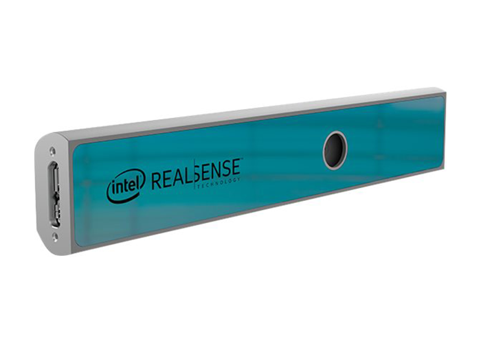
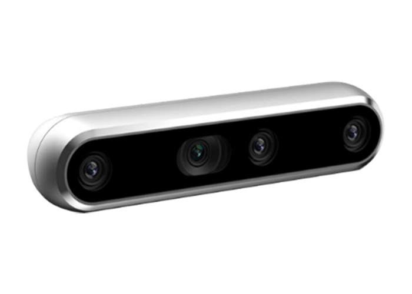

# Intel RealSense Codes
My own collection of python scripts to control Intel RealSense D400 and SR300 cameras📷

### This repository has the code for the following tasks:
  - PointCloud
  - MultipleCameras

## Tested Cameras
This code was tested on Intel RealSense SR305 and D415 cameras.





### Requirements
- Python 3.9.7

### Dependencies
```bash
pip install -r requirements.txt
```

# License
This project is licensed under the MIT License.