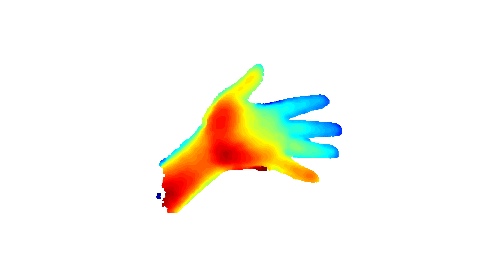

# Intel RealSense Codes
My own collection of python scripts to control Intel RealSense D400 and SR300 cameras📷

### This repository has the code for the following tasks:
### PointCloud
This code is a tool for capturing point clouds, it answers for the number of points and each take can be saved or descarted.

It can saves the point cloud (in png or csv format), the depth image and the rgb camera image.




Saves the point cloud in x,y,z format
```csv
1.368744205683469772e-02,7.372751832008361816e-02,-3.430000245571136475e-01
1.426214165985584259e-02,7.372751832008361816e-02,-3.430000245571136475e-01
1.483684126287698746e-02,7.372751832008361816e-02,-3.430000245571136475e-01
1.545647252351045609e-02,7.394246011972427368e-02,-3.440000116825103760e-01
1.603284850716590881e-02,7.394246011972427368e-02,-3.440000116825103760e-01
...
```

### MultipleCameras
The code can handle multiple intel realsense cameras and can get the skeleton and xyz points from each camera.

It can saves rgb images with the overlayed skeletons.


It also save the skeleton points in a #_point,x,y,z format.
```csv
0.000000000000000000e+00,4.290000000000000000e+02,6.100000000000000000e+01,2.995000123977661133e+00
1.000000000000000000e+00,4.330000000000000000e+02,5.400000000000000000e+01,3.074000120162963867e+00
4.000000000000000000e+00,4.270000000000000000e+02,5.500000000000000000e+01,3.083000183105468750e+00
5.000000000000000000e+00,4.260000000000000000e+02,5.500000000000000000e+01,3.083000183105468750e+00
6.000000000000000000e+00,4.250000000000000000e+02,5.500000000000000000e+01,3.074000120162963867e+00
...
```
  
## Tested Cameras
This code was tested on Intel RealSense SR305 and D415 cameras.


### Requirements
- Python 3.9.7

### Dependencies
```bash
pip install -r requirements.txt
```

# License
This project is licensed under the MIT License.